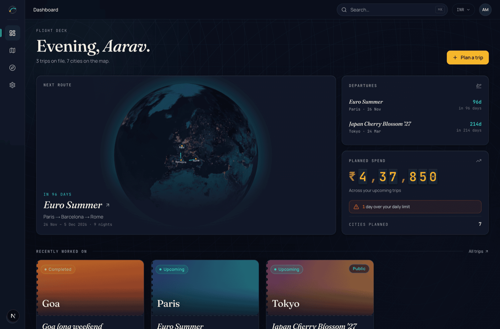
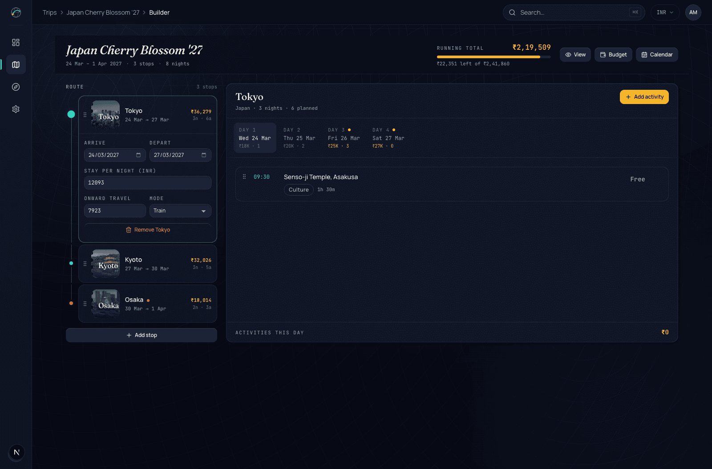
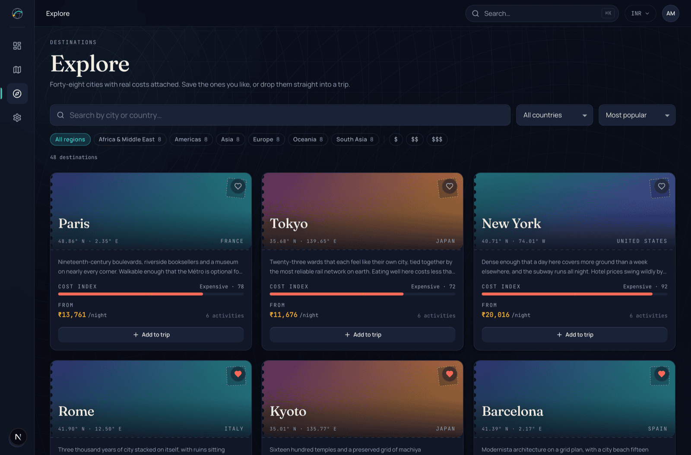
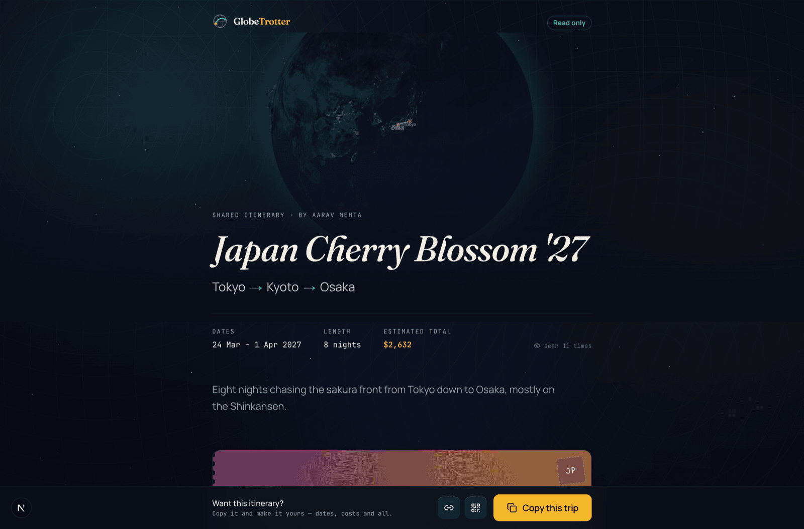
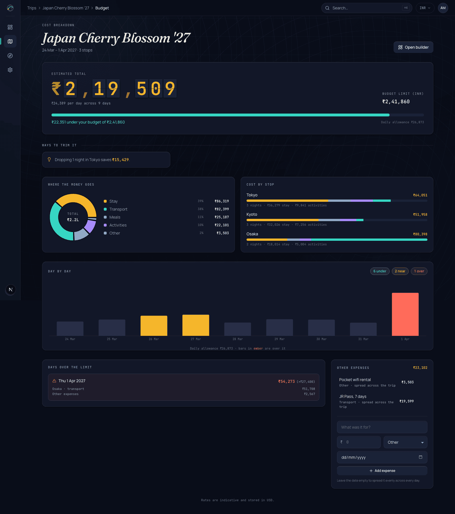
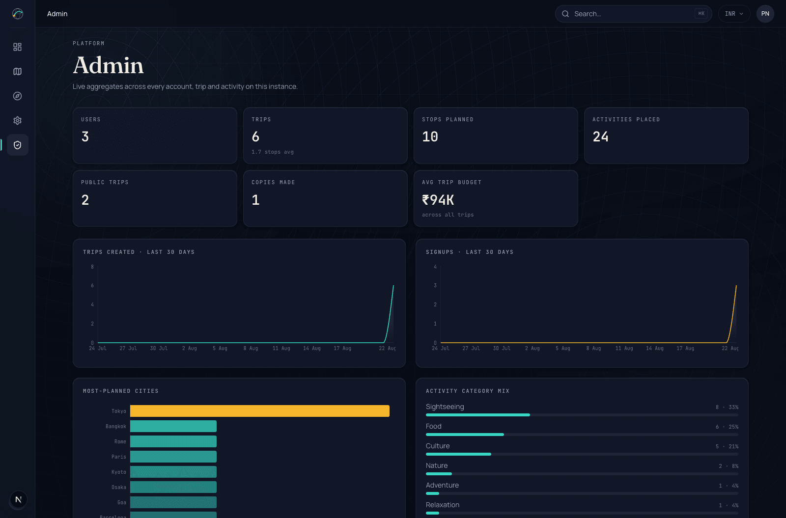
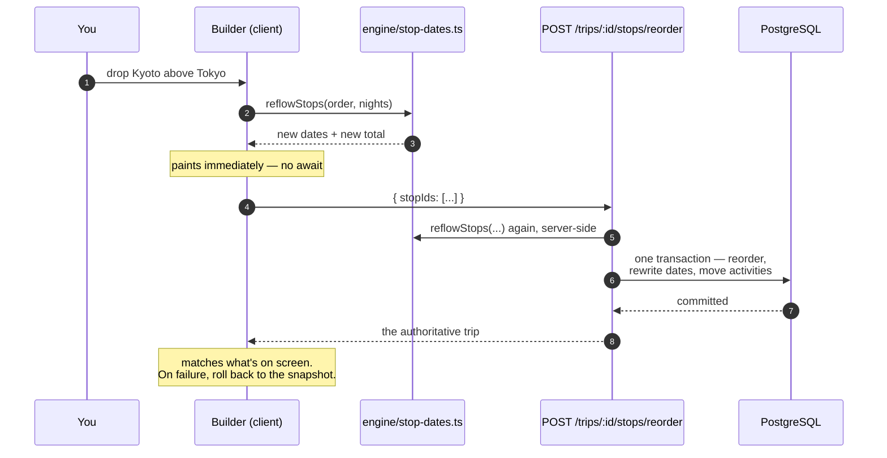

<div align="center">



**A multi-city trip planner where the route, the calendar and the money are the same object.**

Move a city and every date re-flows, every activity travels with it, and the total
changes while your finger is still down.

<sub>
Next.js&nbsp;16 · React&nbsp;19 · TypeScript&nbsp;strict · PostgreSQL&nbsp;15 · Prisma&nbsp;6 · Tailwind&nbsp;v4
</sub>

### [**▲ Live — globetrotter-wine-ten.vercel.app**](https://globetrotter-wine-ten.vercel.app)

<sub>Sign in with `demo@globetrotter.app` / `Demo@1234` — there's a one-click button on the login screen.</sub>

<sub>Built for the **Odoo × LDCE Ahmedabad Hackathon '26**</sub>

</div>

---

## What it is

Plan a trip across as many cities as you like. Give each stop a date range and a
nightly cost, drop activities onto real days, and watch a live budget break the
whole thing down by category, by stop and by day — flagging the days that go
over your allowance. When it's ready, publish it as a read-only page anyone can
open and copy into their own account.

Everything on every screen is real: **48 cities**, **288 activities**, 3 demo
trips, all out of PostgreSQL. There is no mock data path in the running app.
Every city carries a real photograph of itself, shipped with the repo rather
than hot-linked — see [photo credits](docs/IMAGE-CREDITS.md).

---

## See it

<table>
<tr>
<td width="50%" valign="top">



**Flight deck** — a WebGL globe drawing your next route arc by arc, a departure
board counting down, and planned spend on split-flap digits.

</td>
<td width="50%" valign="top">



**Builder** — drag a stop and the dates below it re-flow. The running total in
the header is computed in the browser by the same engine the server uses.

</td>
</tr>
<tr>
<td width="50%" valign="top">



**Explore** — trigram search across cities and activities, answering in
single-digit milliseconds, with the measured server time shown live in the
header.

</td>
<td width="50%" valign="top">



**Share** — a public, read-only page with its own OG image and QR code, both
rendered locally. One button copies the whole itinerary into your own account.

</td>
</tr>
<tr>
<td width="50%" valign="top">



**Budget** — where the money goes, cost by stop, and a day-by-day bar chart
where over-limit days turn ember. All three budget states are visible at once.

</td>
<td width="50%" valign="top">



**Admin** — real aggregates over the live database: user and trip counts, the
most-planned cities, the most-added activities.

<br>


**Landing** — a 2.6-second opening: a route draws itself between four cities,
each node lands with a ring, then the whole thing lifts away.

</td>
</tr>
</table>

---

## Architecture

<div align="center">
  
</div>

Five layers, one direction of travel. Nothing skips a layer, and two rules hold
the whole thing together:

**1. The engine is pure.** `budget.ts` and `stop-dates.ts` take plain numbers and
plain ISO strings and return plain numbers. No database, no `Date` objects, no
I/O. That's what lets the *same file* run in a route handler and in the browser
during a drag — so the optimistic total you see mid-gesture and the total the
server later confirms cannot disagree. It's also why the tests are worth
something: 21 of them, all against this layer, running in 13 ms.

**2. Nothing from Prisma crosses to the client.** `Decimal` and `Date` stop at
the service layer and come back as `number` and `"YYYY-MM-DD"`. The DTO types in
`src/server/dto.ts` are the only shapes a component ever sees, so a currency
value can't silently become a float and a calendar date can't shift by a
timezone.

<details>
<summary><b>What a mutation actually does</b> — dragging Kyoto above Tokyo</summary>

<br>



The client and the server call the identical function, so step 3 and step 6
produce the same answer. The transaction is the interesting part: reordering
stops rewrites the date range of every stop after the moved one, and each
activity is pinned to a day *within* its stop — so the activities move too, in
the same commit. Half-applied is not a reachable state.

</details>

<details>
<summary><b>The 11 tables</b></summary>

<br>

`User` · `PasswordResetToken` · `City` · `Activity` · `Trip` · `TripStop` ·
`StopActivity` · `TripExpense` · `TripCollaborator` · `SavedCity` ·
`ActivityEvent`

Money is `Decimal(10,2)`, never a float. Calendar dates are `@db.Date`, never a
timestamp — a trip that starts on 24 March starts on 24 March in every timezone.
Search runs on `pg_trgm` GIN indexes, which is why it's measured in single-digit
milliseconds rather than a `LIKE '%…%'` sequential scan.

Full ER diagram and the reasoning behind every index:
[`docs/DB-SCHEMA.md`](docs/DB-SCHEMA.md).

</details>

---

## Run it

Requires **Node 22+**, **pnpm**, and a local **PostgreSQL 15 or 16**.

```bash
# 1. Database
createdb globetrotter

# 2. Environment — copy and set DATABASE_URL to your local Postgres
cp .env.example .env

# 3. Install, migrate, seed
pnpm install         # postinstall runs `prisma generate` for you
pnpm db:deploy       # creates the 11 tables + pg_trgm search indexes
pnpm db:seed         # 48 cities, 288 activities, 2 users, 3 demo trips

# 4. Go
pnpm dev             # http://localhost:3000
```

`db:deploy` applies the existing migrations, which is what you want on a fresh
machine. `db:migrate` (`prisma migrate dev`) is for when you're changing the
schema.

### Sign in

| Account | Email | Password |
|---|---|---|
| Traveller (has demo trips) | `demo@globetrotter.app` | `Demo@1234` |
| Admin | `admin@globetrotter.app` | `Admin@1234` |

The login screen has a one-click button for each, so you don't have to type them.

### The 60-second tour

1. Sign in as the demo traveller → **Dashboard**: globe drawing the next trip's
   route, a departure board, and total planned spend on split-flap digits.
2. Open **Japan Cherry Blossom '27 → Builder**: drag Kyoto above Tokyo. Every
   date re-flows and the running total moves as you drop it.
3. **Budget**: one day is over the daily allowance, two are close. All three
   states on one screen.
4. **Share** → the trip is already public at
   [`/s/japan-sakura-27`](http://localhost:3000/s/japan-sakura-27). Open it in a
   private window: read-only, with a copy button.

---

## Measured performance

`pnpm bench` with the app running and the database seeded. These are the
server's own numbers, read from the `Server-Timing` header — not round-trip
time. Run on an M-series Mac against local Postgres.

In production the same trigram search settles at **~11 ms** rather than 2.6 ms:
the query is as fast, but the Vercel function and Neon are separate machines,
so each round trip crosses a network the local numbers never touch. The first
request after an idle period is slower again (~280 ms) while Neon's compute
wakes.

| Endpoint | p50 | p95 | Budget |
|---|---|---|---|
| `GET /cities?q=` (trigram search) | 2.6 ms | 4.3 ms | 15 ms |
| `GET /cities` (list) | 2.6 ms | 3.6 ms | 50 ms |
| `GET /cities/:slug/activities` | 1.2 ms | 1.6 ms | 50 ms |
| `GET /trips` | 4.3 ms | 5.3 ms | 50 ms |
| `GET /trips/:id/budget` | 5.1 ms | 6.2 ms | 25 ms |
| `GET /dashboard` | 4.8 ms | 9.0 ms | 50 ms |

Set `NEXT_PUBLIC_SHOW_PERF=1` (it's on in `.env.example`) and the app shows the
last measured response time live, in the cockpit bar and the Explore header.

---

## How it's built

| Layer | Choice |
|---|---|
| Framework | Next.js 16 (App Router, RSC, Turbopack), React 19 |
| Language | TypeScript, `strict`, no `any`, no `@ts-ignore` |
| Database | PostgreSQL + Prisma 6 — 11 normalised tables, `pg_trgm` search indexes |
| Styling | Tailwind v4 (`@theme` tokens), Radix primitives restyled |
| Validation | zod schemas shared by client forms and server handlers |
| Auth | bcryptjs + `jose` JWT in an httpOnly cookie. No auth library. |
| Motion | `motion` — reorder, layout animation; CSS for page transitions |
| 3D | `react-globe.gl` / three.js, dynamically imported, globe routes only |
| Charts | recharts, dynamically imported, budget and admin routes only |

**17 screens, 36 REST route handlers, 177 TypeScript files, ~17,400 lines.**

### The design system

Dark by default — "night atlas". Serif display type against a monospace data
voice, so a number never looks like prose. Buttons carry a real edge and press
into it. Surfaces sit on a backdrop that moves slowly enough that you notice it
only if you look. Every animation is behind `prefers-reduced-motion`, and the
whole palette is defined once as `@theme` tokens in `src/app/globals.css`.

### Email

Signing up sends two messages: a **welcome** to the new account, and a **new
signup notification** to `OWNER_EMAIL` carrying the name, address, user id,
timestamp and the live user count.

Both are hand-built table layouts in the NIGHT ATLAS palette with a plain-text
alternative, because email is not the web — no flexbox, no grid, no webfonts,
and Outlook renders through Word. `pnpm preview:emails` writes them to disk to
look at; `pnpm send:test-email` posts them for real.

Two properties worth knowing:

- **An email can never fail a signup.** Both sends are detached, exactly like
  `logEvent`. With the SMTP password deliberately wrong, signup still returns
  `200`, the account is still created, and the failure is one line on the log.
- **With no SMTP credentials the whole thing turns itself off** and says so.
  Cloning this repo and signing up works without anyone's mailbox.

Templates are pure functions, so they're unit-tested like the engines — 14
tests, including that a display name of `` comes out
as inert escaped text.

### It works offline

No runtime network dependency: fonts are committed to `public/fonts`, globe
textures to `public/globe`, all 48 city photographs to `public/cities`, QR codes
are generated server-side by the `qrcode` package, and OG images are rendered
locally by `next/og`. Unplug the machine and every screen still works.

The city photos are Wikimedia Commons originals, resized to 1000×563 and encoded
as WebP (~86 KB each, 4 MB for the set) by `scripts/build-city-images.mjs`.
They are stored rather than hot-linked for the same reason as everything else
here, and because 48 cards going blank on conference wifi is not a risk worth
taking. Author and licence for each one is in
[`docs/IMAGE-CREDITS.md`](docs/IMAGE-CREDITS.md).

Next's image optimiser is deliberately off — see the comment in `next.config.ts`
for the exFAT reason, which is not a preference.

---

## Where things live

```
prisma/            schema, migrations, seed + seed data
src/
  app/
    (marketing)/   landing
    (auth)/        login · signup · forgot · reset
    (app)/         everything behind the auth guard
    s/[slug]/      public share page + OG image
    api/v1/        36 REST route handlers
  components/
    ui/            the design system (DeckButton, Postcard, SplitFlap, RouteLine…)
    layout/        app shell — rail, top bar, breadcrumbs, ⌘K palette
    trips/ budget/ calendar/ explore/ share/ admin/   feature components
  server/
    engine/        pure budget + date logic (this is where the tests are)
    services/      all database access, all access control
    http/          withApi envelope, error vocabulary, pagination
  lib/             validators, currency, dates, api-client
```

| Document | Contents |
|---|---|
| [`docs/ARCHITECTURE.md`](docs/ARCHITECTURE.md) | Layering, data flow, the design system |
| [`docs/DB-SCHEMA.md`](docs/DB-SCHEMA.md) | ER diagram, every index and why it exists |
| [`docs/API.md`](docs/API.md) | Every endpoint with a request and a response |
| [`docs/DECISIONS.md`](docs/DECISIONS.md) | Decisions taken during the build, and why |
| [`docs/DEMO-SCRIPT.md`](docs/DEMO-SCRIPT.md) | The five-minute demo, in order |
| [`docs/IMAGE-CREDITS.md`](docs/IMAGE-CREDITS.md) | Author and licence for all 48 city photos |
| [`docs/REVIEW-CHEATSHEET.md`](docs/REVIEW-CHEATSHEET.md) | Straight answers to "why did you do it that way" |

---

## Scripts

| Command | What it does |
|---|---|
| `pnpm dev` | Development server |
| `pnpm build` / `pnpm start` | Production build and serve |
| `pnpm verify` | typecheck → lint → tests → build. The gate before every commit. |
| `pnpm typecheck` | `tsc --noEmit`, strict, no `any` |
| `pnpm lint` | ESLint incl. the React Compiler rules |
| `pnpm test` | 21 vitest unit tests over the budget and date engines |
| `pnpm db:migrate` | Apply migrations |
| `pnpm db:seed` | Seed (idempotent — safe to re-run) |
| `pnpm db:reset` | Drop, re-migrate and re-seed. **Destroys data.** |
| `pnpm db:studio` | Prisma Studio |
| `pnpm bench` | Measure the API against the performance budget |
| `pnpm check:images` | HEAD-check every image URL in the database |
| `pnpm preview:emails` | Render both signup emails to disk. Sends nothing. |
| `pnpm send:test-email` | Actually post both, to `OWNER_EMAIL` or an address you pass |
| `pnpm build:city-images` | Rebuild `public/cities/` from Wikimedia Commons |

---

## Notes for whoever runs this next

- **`pnpm db:reset` will refuse to run under an AI agent** without explicit
  consent — that's a Prisma 6.19 safety feature, not a bug. Run it yourself.
- **Use pnpm, not npm.** `node_modules` is pnpm-linked, and `npm install` would
  rebuild it incorrectly — a `preinstall` guard stops that with a message.
  `npm run <script>` is fine either way.

  ```bash
  corepack enable && pnpm install
  ```

- **This repo was developed on an exFAT volume**, which needs one workaround,
  documented in `scripts/clean-appledouble.mjs`. macOS writes AppleDouble
  sidecars (`._name`) next to any file carrying extended attributes. They are
  binary but keep the original name, so `._page.tsx` looks like a route to
  Next.js, `._budget.test.ts` looks like a test to vitest, and — the one that
  took longest to find — `._00000001.sst` inside Turbopack's cache database
  makes every build after the first fail with `Failed to open database …
  invalid digit found in string`, because Turbopack parses those filenames as
  sequence numbers. Deleting the sidecars before each gate takes ~0.3 s and
  fixes all three. On APFS or ext4 it finds nothing and costs nothing.

- **`next dev` and `next build` use separate `distDir`s** (`.next-dev` and
  `.next`, see `next.config.ts`). Next locks a `distDir` so dev and build can't
  write one concurrently; giving them one each means you can run a build while
  the dev server is up.
