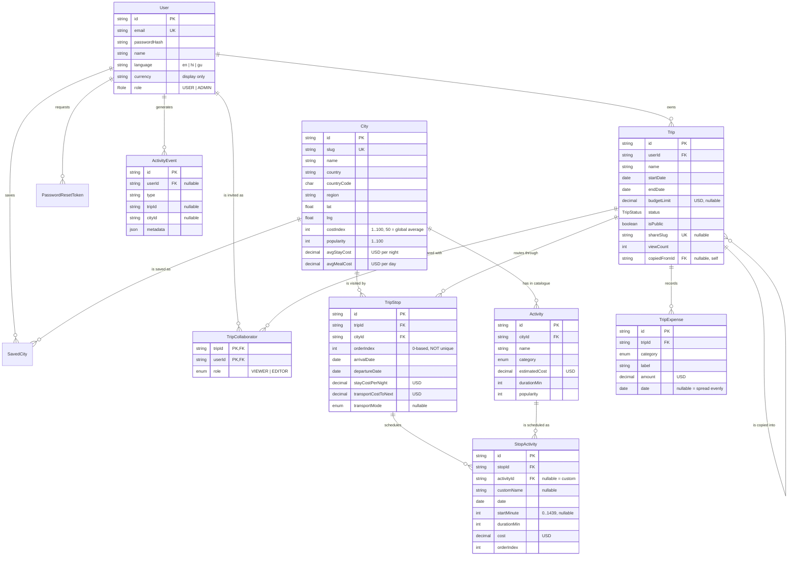

# Database schema

PostgreSQL 15/16, eleven tables, third normal form. Source of truth is
`prisma/schema.prisma`.

## ER diagram



---

## Design decisions, and the reasoning

### Money is `Decimal(10,2)`, never a float

`0.1 + 0.2 !== 0.3` in binary floating point. A budget planner that quietly
loses a cent per activity is worse than one that doesn't exist. Postgres
`numeric` is exact. Prisma hands it back as a `Decimal` object, which
`src/server/dto.ts` converts to a plain `number` exactly once, at the boundary.

### Dates are `@db.Date`, never `timestamptz`

A trip starting "24 March" starts on 24 March in Tokyo and in Ahmedabad. It is a
calendar date, not an instant. Storing it as a timestamp means it shifts by
timezone and the classic "my trip starts a day early in IST" bug appears. All
date maths in `src/lib/dates.ts` is UTC-based for the same reason.

### Everything is stored in USD

One currency in the database, converted for display only. `User.currency` is a
presentation preference. Mixing currencies in a `SUM` is how budget software
produces confidently wrong numbers.

### `TripStop.orderIndex` is deliberately **not** unique

A unique constraint would make reordering impossible without a temporary
negative-index dance, because you can't have two stops at index 1 mid-shuffle.
Reordering rewrites every index inside one `$transaction`, so no intermediate
state is ever visible. The trade-off — duplicate indexes are theoretically
possible — is bounded by that transaction being the only writer.

### `StopActivity.activityId` is nullable

A null `activityId` plus a `customName` is a custom activity: "Dinner with
Kenji". A planner that can only add things from its own catalogue is a
catalogue, not a planner. Nullable is what keeps user-invented activities out of
the shared `Activity` table.

`onDelete: SetNull` on that relation means removing a catalogue activity
downgrades a scheduled one to custom rather than silently deleting it from
someone's itinerary.

### `ActivityEvent` is an append-only log

The admin dashboard aggregates it live. Nothing on `/admin` is a stored counter
that can drift from reality — delete a trip and the KPI moves.

### `shareSlug` survives going private

Turning sharing off sets `isPublic = false` but keeps the slug. Re-enabling
restores the same URL, so a link someone already sent doesn't break.

---

## Indexes, and what each one is for

Every foreign key is indexed. Beyond that:

| Index | Serves |
|---|---|
| `User.email` (unique) | login, and the uniqueness check on signup |
| `Trip(userId, startDate)` | "my upcoming trips", dashboard |
| `Trip(userId, updatedAt)` | "recently worked on", default sort on `/trips` |
| `Trip(isPublic, updatedAt)` | public trip listings |
| `Trip.shareSlug` (unique) | the `/s/[slug]` lookup |
| `TripStop(tripId, orderIndex)` | loading a route in order |
| `TripStop(tripId, arrivalDate)` | calendar and date-conflict checks |
| `TripStop.cityId` | "most-planned cities" on `/admin` |
| `StopActivity(stopId, date, orderIndex)` | the day canvas — one index covers filter *and* sort |
| `TripExpense(tripId, category)` / `(tripId, date)` | budget grouping |
| `City.region` / `.country` / `.popularity` / `.costIndex` | every Explore filter and sort |
| `Activity(cityId, category)` / `(cityId, estimatedCost)` / `(cityId, durationMin)` | the three activity filters |
| `ActivityEvent(type, createdAt)` / `(userId, createdAt)` | admin trend charts |

### Trigram search indexes

Migration `20260822050653_pg_trgm_search_indexes`:

```sql
CREATE EXTENSION IF NOT EXISTS pg_trgm;
CREATE INDEX city_name_trgm_idx     ON "City"     USING gin (name gin_trgm_ops);
CREATE INDEX city_country_trgm_idx  ON "City"     USING gin (country gin_trgm_ops);
CREATE INDEX activity_name_trgm_idx ON "Activity" USING gin (name gin_trgm_ops);
```

A btree index can't help `WHERE name ILIKE '%kyo%'` — a leading wildcard defeats
it, so Postgres falls back to a sequential scan. A GIN trigram index breaks each
string into three-character grams and indexes those, so an infix match becomes
an index lookup. It also makes the search forgiving: typing `kyo` returns both
**Kyo**to and To**kyo**.

Measured: 2.6 ms p50, 4.3 ms p95 (`pnpm bench`).

---

## Cascade behaviour

| Deleting | Cascades to |
|---|---|
| a `User` | their trips → stops → stop activities → expenses; saved cities; reset tokens |
| a `Trip` | its stops → stop activities; expenses; collaborators |
| a `TripStop` | its stop activities |
| a `City` | its catalogue activities |
| an `Activity` | **nothing** — scheduled copies survive with `activityId → NULL` |
| a copied-from `Trip` | **nothing** — the copy survives with `copiedFromId → NULL` |

The last two are `SetNull` on purpose: deleting something from the catalogue
must never silently remove a day from a stranger's holiday.
